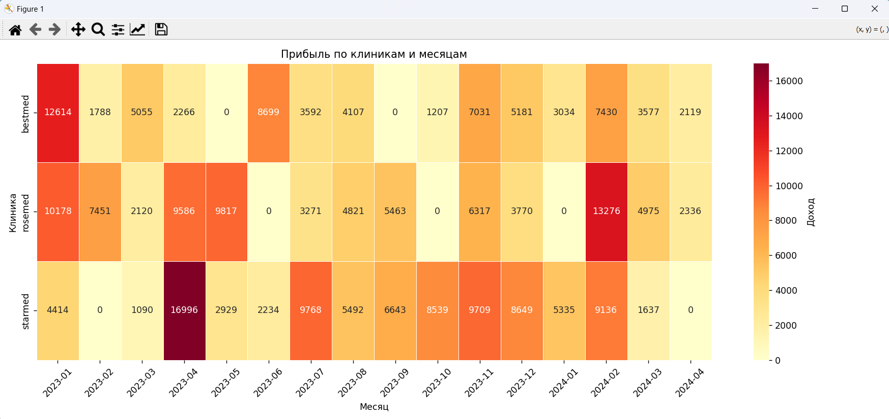
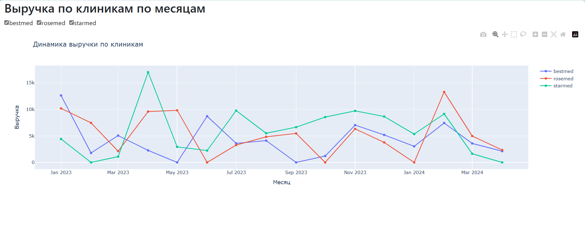
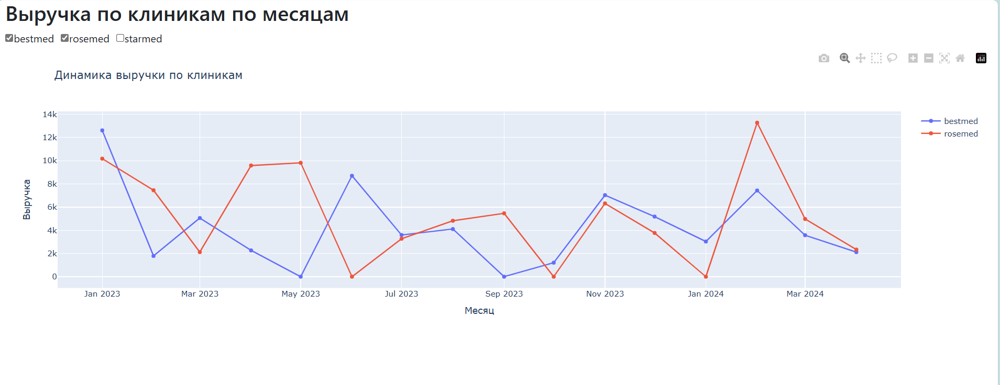
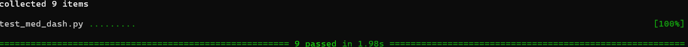

# 🩺 Медицинский аналитический дашборд (Dash + SQLite)

Интерактивный дашборд для визуализации данных о приёмах пациентов в клиниках. Проект демонстрирует полный цикл работы: от генерации данных и SQL-запросов до построения интерактивных графиков в Dash.

## 🔧 Технологии

- **Python**: pandas, numpy, sqlite3
- **Dash + Dash Bootstrap Components**: интерфейс дашборда
- **Plotly**: интерактивные графики
- **Matplotlib + Seaborn**: тепловая карта
- **SQLite** (in-memory): база данных

---

## 📌 Описание проекта

Проект имитирует данные медицинских учреждений. Генерируется таблица пациентов и таблица приёмов. Выполняются SQL-запросы для получения ключевых метрик, создаётся сводная таблица и визуализируется через:

- 📊 **Тепловую карту (heatmap)** — выручка по клиникам и месяцам
- 📈 **Интерактивный график Dash** — фильтрация по клиникам и отображение выручки по месяцам

---

## 📊 Основной функционал

- Создание базы данных и таблиц (`patients`, `doctors`)
- Генерация 100+ записей о приёмах и 20 пациентов
- SQL-запросы для анализа:
  - Общее количество пациентов
  - Общая сумма выручки
  - Выручка по диагнозам и клиникам
- Построение сводной таблицы (Pivot)
- Отрисовка тепловой карты с помощью seaborn
- Dash-для отображения графика с фильтрацией по клиникам

---

## 🖼️ Примеры визуализаций

### 🔥 Тепловая карта



---

### 📈 График выручки в Dash



---

## ▶️ Запуск проекта

1. Установите зависимости:
```bash
pip install -r requirements.txt
```
2. Запустите файл:
```bash
python med_dash_sql_project.py
```
3. В браузере откроется дашборд по адресу:
```cpp
http://127.0.0.1:8050/
```
---

## 🔎 Почему этот проект интересен
✅ Демонстрирует уверенное владение:

- SQL и pandas для обработки данных
- matplotlib / seaborn для аналитических визуализаций
- Dash для построения пользовательского интерфейса
- Автоматизация полного цикла аналитики

## 📌 Идеи для доработки
- Добавить выгрузку отчёта в PDF/Excel
- Сделать возможность выбора периода времени
- Добавить агрегацию по врачам и диагнозам

## 🧪 Тестирование
Тесты покрывают ключевые функции проекта, включая:
- Проверку создания базы данных и правильности структуры таблиц
- Проверку корректности выполнения SQL-запросов
- Проверку работы дашборда с фильтрацией клиник

## Запуск тестов:
```bash
pytest
```
## Результат тестирования

---
